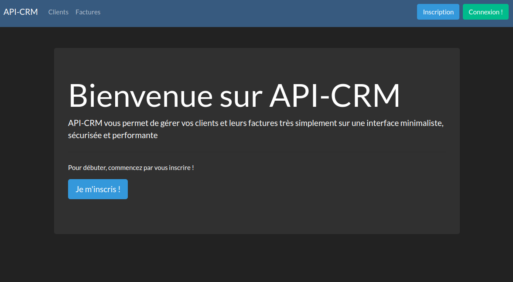
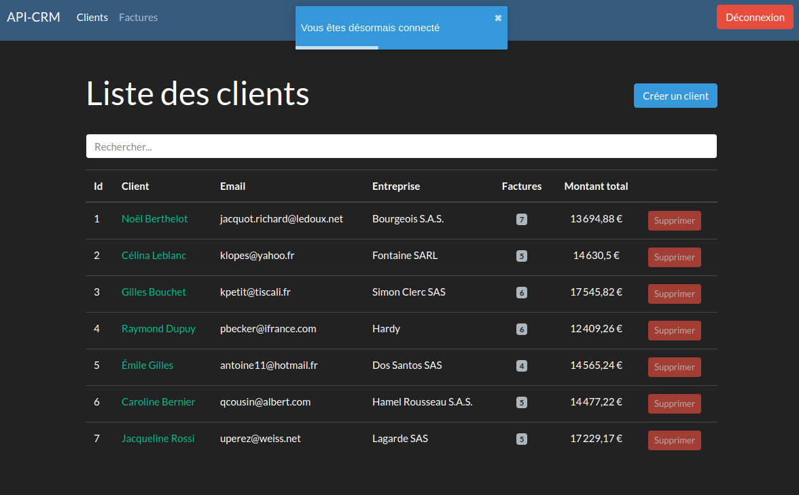
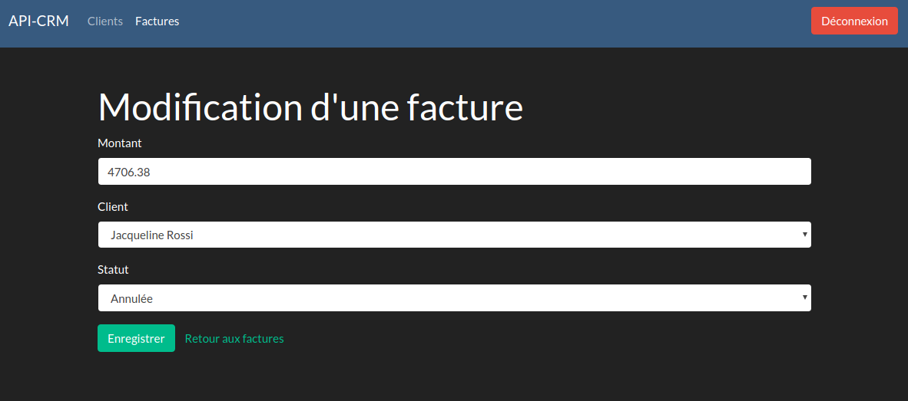

# API-CRM

**API-CRM** is an interface to manage your for each customer, their invoices by being able to create, modify or delete them.

You can create an account to get access to customers and invoices (you'll need to create them).

___

This CRM is built with **Symfony** and communicate with an API REST built with **API-Platform**, the front-end is made with **React** and **Axios** to fetch datas.
